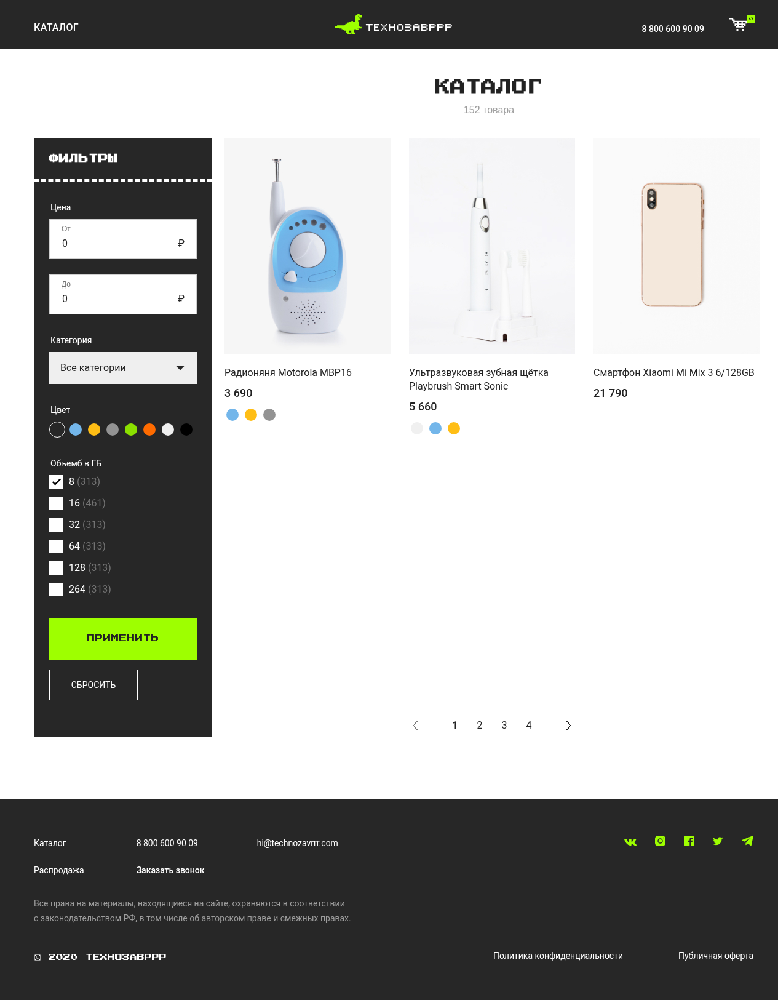
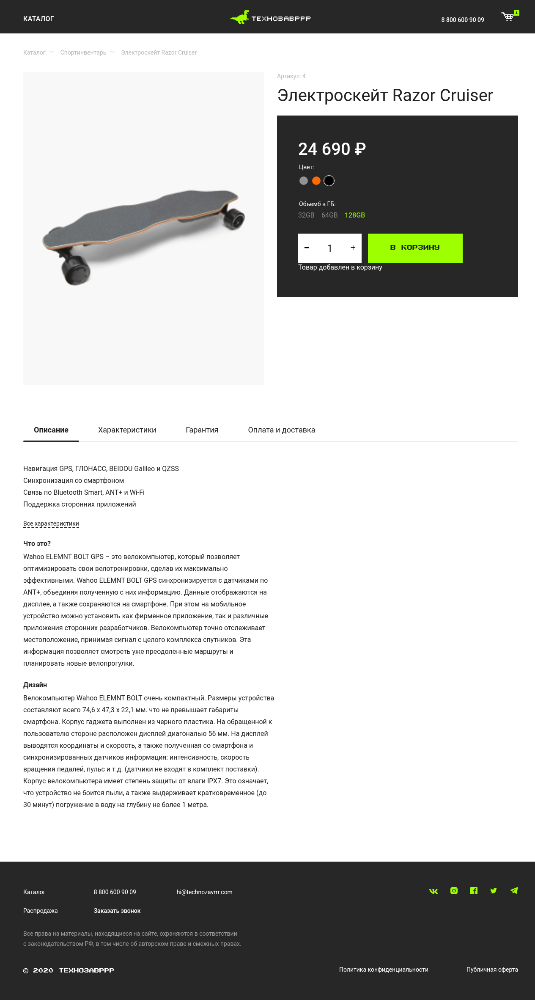
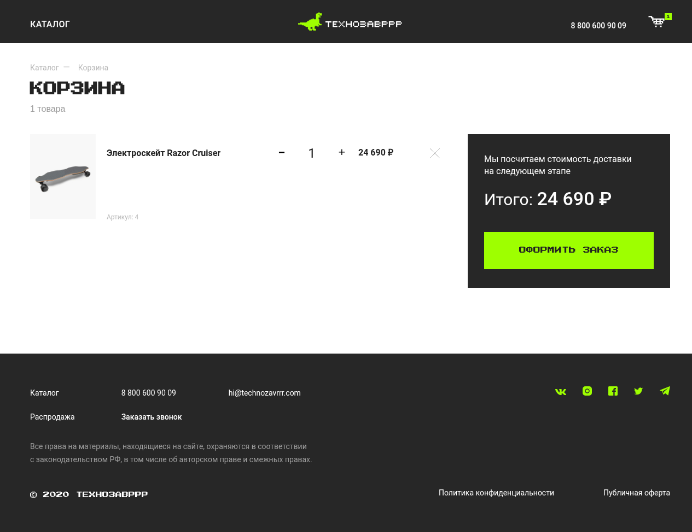

# Technozavrrr — Vue 2 online store

A single-page online-store front end built with **Vue 2, Vuex and Vue Router**. It has a filterable, paginated product catalog, product pages and a server-synced shopping cart.

**Live demo:** https://vue2-project-8bweeygsd-varvara.vercel.app/

| Catalog | Product page | Cart |
| :---: | :---: | :---: |
|  |  |  |

> The project started as a Vue 2 learning project that used a public course API (`vue-study.skillbox.cc`). That API has since been shut down, so I reproduced its REST contract myself in two ways: a small Express mock server and an in-browser mock used for the deployed demo (see [Architecture](#architecture)). The store layout and styles come from the course template; the application code (components, store, routing, API layer) is what this repository is about.

## Features

- **Catalog** with server-side pagination and filtering by category and price range.
- **Product page** loaded by route (`/product/:id`) with category breadcrumbs, quantity selector and "add to cart" with loading/confirmation state.
- **Shopping cart** that stays in sync with the backend: add, change quantity (with rollback if the request fails) and remove items; the header badge and order total update reactively.
- **Cart persistence** via a `userAccessKey` stored in `localStorage`, so the cart survives page reloads.
- Loading and error states for product requests, with a retry button.
- Custom pagination component using `v-model`, and filter component using the `.sync` modifier.

## Tech stack

| Area | Tools |
| --- | --- |
| Framework | Vue 2.6, Vue Router 3 (hash mode), Vuex 3 |
| HTTP | axios |
| Build | Vue CLI 5 (webpack), Babel |
| Code quality | ESLint, Prettier |
| Mock backend | Node.js, Express 4 |
| Hosting | Vercel (static build) |

## Architecture

All network access goes through one place, `API_BASE_URL` in [src/config.js](src/config.js), and the app talks to a small REST contract:

| Method | Endpoint | Purpose |
| --- | --- | --- |
| GET | `/api/products?page&limit&categoryId&minPrice&maxPrice` | Paginated, filtered product list |
| GET | `/api/products/:id` | Single product |
| GET | `/api/productCategories` | Categories for the filter |
| GET | `/api/baskets?userAccessKey` | Current cart (creates one if no key) |
| POST | `/api/baskets/products?userAccessKey` | Add a product `{productId, quantity}` |
| PUT | `/api/baskets/products?userAccessKey` | Set quantity `{productId, quantity}` |
| DELETE | `/api/baskets/products?userAccessKey` | Remove a product `{productId}` |

That contract can be served in two interchangeable ways:

1. **Express mock server** ([server/](server/)) — a real HTTP API with in-memory carts. Used for local development.
2. **In-browser mock** ([src/mockApi.js](src/mockApi.js)) — a custom axios adapter that answers the same requests inside the browser and keeps carts in `localStorage`. It is switched on by the `demo` build mode, which is what the live demo uses, so the site is fully static and needs no server.

Application state lives in a Vuex store ([src/store/index.js](src/store/index.js)): cart items, the access key and getters for the detailed cart list and the total price.

## Getting started

Requires Node.js 18+.

```bash
npm install
```

**Option A — with the Express mock server** (two terminals):

```bash
cd server && npm install && npm start   # API on http://localhost:3000
npm run serve                           # app on http://localhost:8080
```

**Option B — without a server** (in-browser mock):

```bash
npm run serve:demo
```

**Other scripts**

```bash
npm run build        # production build; expects a real API (see below)
npm run build:demo   # production build with the in-browser mock (used for Vercel)
npm run lint
```

To point a build at a different API, set `VUE_APP_API_BASE_URL` (defaults to `http://localhost:3000`).

## Deployment

The demo is deployed on Vercel as a static site:

- Build command: `npm run build:demo`
- Output directory: `dist`

## Project structure

```
src/
  components/   ProductFilter, ProductList, ProductItem, CartItem, CounterForm, BasePagination, ...
  pages/        MainPage, ProductPage, CartPage, NotFoundPage
  router/       route definitions
  store/        Vuex store (cart state and API actions)
  helpers/      number formatting, navigation helper
  data/         seed data for the mock API
  mockApi.js    in-browser implementation of the API
  config.js     API base URL
server/         Express mock API (Dockerfile included)
```

## Roadmap

Known gaps and planned improvements:

**UX**
- Empty states: message when the filtered catalog has no results and when the cart is empty.
- Make the color filter work (the selected color is tracked but not sent to the API) and either implement or remove the static "volume" checkboxes.
- Replace the hard-coded "152 товара" counter with the real total from the API.
- Show loading and error states for the cart (not only for products) and surface failed cart requests to the user.
- Reflect the current page and filters in the URL query so filtered views can be shared and survive reloads.
- Validate the price range (from ≤ to, no negatives).
- Checkout flow: the "Place order" button is not wired to anything yet.

**Product page**
- Render real product data instead of the static description text, tabs and memory-size options.
- Use meaningful `alt` text for product images (the catalog uses a placeholder).
- Add an image gallery.

**Code quality**
- Remove leftover `console.log` calls in `ProductPage.vue`.
- Extract API calls from components into a dedicated service module.
- Add unit tests (store, mock API, components) and an end-to-end test for the cart flow.
- Add a GitHub Actions workflow running lint and build on every push.
- Show a toast notification on errors instead of inline messages.

**Tech**
- Migrate from Vue 2 (end of life) to Vue 3 with Vite and Pinia.
- Add responsive/mobile layout checks and accessibility audit (keyboard navigation, ARIA for the cart badge and filters).
- Serve images as WebP with `srcset`.
- Optionally, host the Express server on a free/paid Node platform to demo the real backend.
