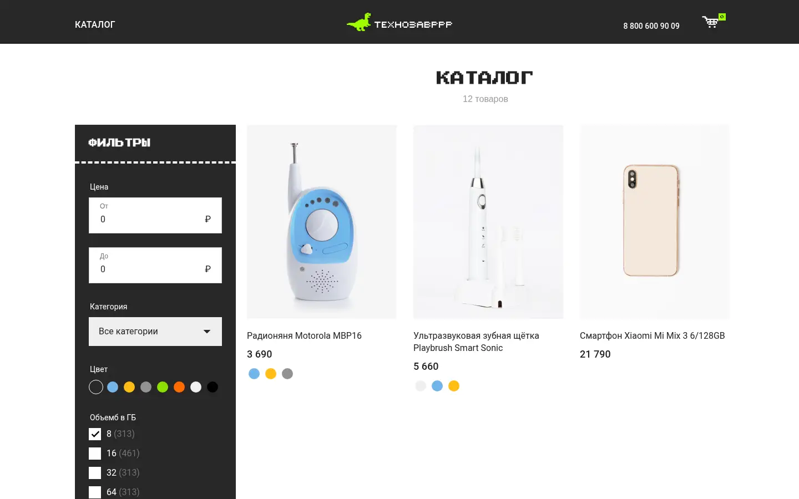

# Technozavrrr Online Store

**English** | [Русский](README.ru.md)

A single-page online store front end built with Vue 2, Vuex and Vue Router: a filterable, paginated catalog, product pages and a server-synced shopping cart. The UI is in Russian.

> 🎓 **Training project** · Skillbox · February–June 2023. The course provided the layout, the styles and a public API (`vue-study.skillbox.cc`), and I wrote the application code. After the API was shut down, I reproduced its contract myself in September 2026. See [Changed afterwards](#changed-afterwards).

**Live demo:** https://vue2-project-ten.vercel.app/




## Highlights

- **One REST contract, two interchangeable backends.** An Express mock server and an in-browser axios adapter answer the same requests, so the live demo is a fully static site.
- **Survived the course API shutdown.** I rebuilt the seven endpoints the app relied on. On the front-end side, I only made the base URL configurable and fixed the cart delete request, which had been sending its body the wrong way.
- **Optimistic cart updates with rollback.** A quantity change goes into Vuex right away and is reverted from the last server response if the request fails.
- **Cart persists across reloads.** The cart is tied to a `userAccessKey` that is kept in `localStorage`.
- **CI on every push.** GitHub Actions runs ESLint and the demo build.

## Features

- **Catalog** with server-side pagination and filtering by category and price range.
- **Product page** loaded by route (`/product/:id`), with category breadcrumbs, a quantity selector and "add to cart" with loading and confirmation states.
- **Shopping cart** synced with the backend: add items, change quantities and remove items. The header badge and the order total update reactively.
- Loading and error states for product requests, with a retry button. Empty states for the catalog and the cart.
- Price filter validation: no negative values, and "from" cannot be greater than "to".
- A custom pagination component using `v-model` and a filter component using the `.sync` modifier.

## Tech stack

| Area | Tools |
| --- | --- |
| Framework | Vue 2.6, Vue Router 3 (hash mode), Vuex 3 |
| HTTP | axios |
| Build | Vue CLI 5 (webpack), Babel |
| Code quality | ESLint, Prettier, GitHub Actions |
| Mock backend | Node.js, Express 4 |
| Hosting | Vercel (static build) |

## Architecture

```
pages / components ──► Vuex store ──► axios ──► API_BASE_URL
                                        │
                                        ├── Express mock server   (npm run serve)
                                        └── in-browser adapter    (demo mode, localStorage)
```

1. [src/config.js](src/config.js) holds the single `API_BASE_URL`, and every request goes through it.
2. [src/store/index.js](src/store/index.js) keeps the cart items and the access key, plus getters for the detailed cart list and the total price. Cart actions replace the local state with the server's response.
3. [MainPage](src/pages/MainPage.vue), [ProductPage](src/pages/ProductPage.vue) and [ProductFilter](src/components/ProductFilter.vue) request products and categories directly. Cart operations go through store actions.
4. The requests reach one of two backends that implement the same contract:
   - [server/](server/) is an Express server with in-memory carts, used for local development.
   - [src/mockApi.js](src/mockApi.js) is a custom axios adapter that answers the same requests inside the browser and keeps carts in `localStorage`.

### API contract

| Method | Endpoint | Purpose |
| --- | --- | --- |
| GET | `/api/products?page&limit&categoryId&minPrice&maxPrice` | Paginated, filtered product list |
| GET | `/api/products/:id` | Single product |
| GET | `/api/productCategories` | Categories for the filter |
| GET | `/api/baskets?userAccessKey` | Current cart (creates one if no key) |
| POST | `/api/baskets/products?userAccessKey` | Add a product `{productId, quantity}` |
| PUT | `/api/baskets/products?userAccessKey` | Set quantity `{productId, quantity}` |
| DELETE | `/api/baskets/products?userAccessKey` | Remove a product `{productId}` |

### Key decisions

- **The mock is an axios adapter, not a separate URL.** The `demo` build mode sets `VUE_APP_USE_MOCK=true` ([.env.demo](.env.demo)), and [src/main.js](src/main.js) swaps `axios.defaults.adapter`. Components and the store don't know which backend answers.
- **The server is the source of truth for the cart.** After every cart request, the store takes the item list from the response and rebuilds its local state from it.
- **Hash-mode routing** (the Vue Router default) lets the static build run on Vercel without rewrite rules.

## Project structure

```
src/
├── components/   # ProductFilter, ProductList, ProductItem, CartItem, CounterForm, BasePagination, …
├── pages/        # MainPage, ProductPage, CartPage, NotFoundPage
├── router/       # route definitions
├── store/        # Vuex store: cart state and API actions
├── helpers/      # number formatting, pluralization, navigation
├── data/         # seed data for the in-browser mock
├── mockApi.js    # in-browser implementation of the API
└── config.js     # API base URL
server/           # Express mock API (Dockerfile included)
```

## Changed afterwards

The original course work ended in June 2023. Everything below was added in September 2026:

- **Express mock server** reproducing the shut-down course API, plus a fix for the cart delete request.
- **In-browser mock API** and the `demo` build mode, so the demo can be deployed as a static site.
- A real product count in the catalog heading, product titles as image `alt`, and no leftover `console.log`.
- Empty states for the catalog and the cart, and price filter validation.
- A CI workflow, this README and the screenshots.

## Getting started

Requires Node.js 18+.

```bash
npm install
```

With the Express mock server (two terminals):

```bash
cd server && npm install && npm start   # API on http://localhost:3000
npm run serve                           # http://localhost:8080
```

Without a server (in-browser mock):

```bash
npm run serve:demo   # http://localhost:8080
```

Other scripts:

```bash
npm run build        # production build against a real API
npm run build:demo   # production build with the in-browser mock (used for Vercel)
npm run lint         # ESLint
```

| Variable | Default | Purpose |
| --- | --- | --- |
| `VUE_APP_API_BASE_URL` | `http://localhost:3000` | API base URL |
| `VUE_APP_USE_MOCK` | not set (`true` in `--mode demo`) | `true` switches to the in-browser mock |

## Deployment

The demo is deployed on Vercel as a static site, with the build command `npm run build:demo` and the output directory `dist`. The Express server has a Dockerfile but isn't hosted. [server/README.md](server/README.md) explains why.

## Known limitations

- The layout from the course template is not responsive. It only looks right on desktop widths.
- The color filter is tracked but not sent to the API. The "volume" checkboxes are static.
- The product page shows a static description, static tabs and static memory-size options instead of real product data.
- The cart has no loading or error states, so failed cart requests are not shown to the user.
- The "Place order" button is not wired to anything.
- The Express server keeps carts in memory, so they are lost on restart.

## What I'd improve

- **Responsive layout and an accessibility pass**, including keyboard navigation and ARIA for the cart badge and the filters.
- **Filters and the current page in the URL query**, so filtered views can be shared and survive reloads.
- **An API service module.** I'd move requests out of components and show errors as toasts instead of inline messages.
- **Tests:** unit tests for the store, the mock API and the components, plus an end-to-end test for the cart flow.
- **A real product page** with an image gallery, and WebP images with `srcset`.
- **A checkout flow**, and hosting the Express server so the real backend can be shown.
